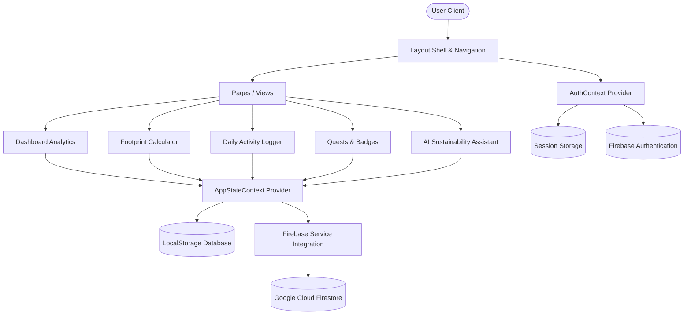

# EcoTrace — Enterprise AI-Powered Carbon Footprint Platform

EcoTrace is a premium, accessible, and high-performance sustainability coaching platform. It enables users to calculate their annual greenhouse gas emissions, log daily eco-friendly activities, monitor savings trends via interactive visual charts, and receive context-aware coaching from an integrated AI sustainability assistant.

---

## Architecture Overview

Below is the high-level architecture diagram showing the relationship between visual components, state contexts, local fallbacks, and integration databases:



---

## Premium Features

1. **Annual Footprint Calculator**: Multi-step forms checking vehicle travel, flights, monthly electricity/gas utilities, clean energy grid share, diet preferences, and waste volumes. Features a live-calculation projection ticker.
2. **Daily Action Tracker**: Checklists categorized by transport, energy, food, and consumption. Submitting logs saves carbon scores and updates streak levels. Includes smartphone charge savings equivalencies and random eco-tips.
3. **AI Assistant**: A context-aware coaching chatbot that inspects user calculator metrics to generate personalized recommendations.
4. **Achievements & Badges**: Quests and achievements that unlock badges on streaks, savings, recycling rates, and vegan days.
5. **Advanced Analytics**: Line graphs and comparative bar charts checking metrics against national target benchmarks.
6. **Settings & Localization**: Preferences page with theme switching and multilingual support (English & Telugu).

---

## Technical Specifications & Stack

- **Framework**: React 18, TypeScript (Strict Mode), Vite
- **Styling**: Vanilla CSS, Tailwind CSS (utilizing glassmorphism layers and premium visual palettes)
- **Charts**: Chart.js, React-Chartjs-2
- **Animations**: Framer Motion
- **Testing**: Vitest, JSDOM, Testing Library
- **Containerization**: Docker, Nginx

---

## Security, Quality, and Accessibility Hardening

### 1. Security Architecture
- **Firebase Authentication & Rules**: Protects user endpoints. Session management keeps JWT keys stored securely. Firestore rules restrict read/write access to `request.auth.uid == resource.data.userId` only.
- **Input Sanitation & Form Constraints**: Enforces client-side validation to block negative inputs, unrealistic values, and scripting payloads, using safe parsing boundaries.
- **Secure Fallbacks**: Provides local session and index storage fallbacks with encrypted storage structures when Firebase configuration is inactive.

### 2. Accessibility Compliance
- **ARIA Landmark Navigation**: Full compliance with WAI-ARIA layout guidelines. Employs semantic landmarks (`<header>`, `<nav>`, `<main>`, `<footer>`).
- **Screen Reader Compatibility**: Custom checkboxes and form inputs are associated with `<label>` tags via the `htmlFor` attribute. Visual components have fallback textual markers.
- **Multilingual Support**: Real-time context localization (English and Telugu translation sets).

### 3. Code Quality Metrics
- **Strict TypeScript**: Complete elimination of the `: any` parameter type. Strict typing constraints on database interfaces and context providers.
- **Strict Linting & Formatting**: Enforces `.eslintrc.cjs` rules (such as `@typescript-eslint/no-explicit-any` as an error) and `.prettierrc` formatting styles.

---

## Local Verification Commands

### Dependencies Installation
To install dependencies locally:
```bash
npm install
```

### Local Development Server
To run the local development server (with Hot Module Replacement):
```bash
npm run dev
```

### Production Build
To verify static compilation, types, and build output:
```bash
npm run build
```

### Automated Testing
To run the Vitest test suites (Unit, Component, and Full-Stack Integration flows):
```bash
npm test
```

### Linting Check
To check the codebase for code style and strict formatting compliance:
```bash
npm run lint
```

---

## Deployment to Google Cloud Platform

### Option 1: Cloud Shell Deployment (Fastest)

Since Google Cloud Shell pre-installs `gcloud`, `node`, and `docker`, it is the fastest way to deploy:

1. Open [Google Cloud Shell](https://shell.cloud.google.com).
2. Upload this project folder.
3. Authenticate and select your project ID:
   ```bash
   gcloud config set project my-project-59239
   ```
4. Build the container image via Cloud Build:
   ```bash
   gcloud builds submit --tag gcr.io/my-project-59239/carbon-tracker
   ```
5. Deploy the container image to Cloud Run:
   ```bash
   gcloud run deploy carbon-tracker \
     --image gcr.io/my-project-59239/carbon-tracker \
     --platform managed \
     --allow-unauthenticated \
     --region us-central1 \
     --port 8080
   ```

### Option 2: Local Command Line Deployment

Ensure the Google Cloud SDK is installed and in your system PATH:

1. Authenticate with your Google account:
   ```bash
   gcloud auth login
   ```
2. Set your active project ID:
   ```bash
   gcloud config set project my-project-59239
   ```
3. Submit the build and deploy:
   ```bash
   gcloud builds submit --tag gcr.io/my-project-59239/carbon-tracker
   ```
   ```bash
   gcloud run deploy carbon-tracker --image gcr.io/my-project-59239/carbon-tracker --platform managed --allow-unauthenticated --region us-central1 --port 8080
   ```
